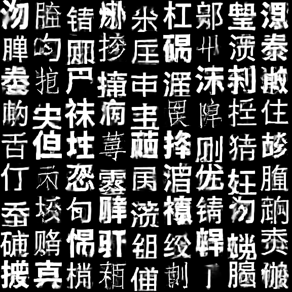
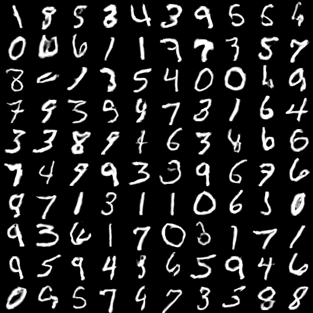
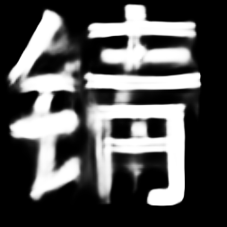

# variant-of-CPPN-GAN
based on https://github.com/kwj2104/CPPN-WGAN, but on chineses fonts and improved architecture. You need pytorch to run it.

  

  

  

<iframe src="https://drive.google.com/file/d/1fo9VEd7-fEWT1LKrH5Yh6m_otV2IOlmJ/preview" width="640" height="480"></iframe>

## Interpolation
to interpolate you run interpolator_casia.py. You may change in main which samples are displayed, size of images and size of grid of images. By default it takes 21st(last) generator from tmp\chinese where generators from different stages of my training are stored.

## Training
Before training you have to download fonts from https://www.kaggle.com/dylanli/chinesecharacter. and put them in file fonts. Then execute script chinese.py To generate images by default it will generate 8k 64x64 images. The periodical image samples, checkpoint and graphs of losses will be saved by default in file tmp/chinese_current. To train you execute gan_cppn_chinese.py script. It should give interesting results fairly quickly. From experience the longer you run the variety of samples increases. You may want to decreas learning rate further in training. The generator checkpoints of my run are saved in file tmp/chinese you may look at them for comparison(use interpolator_chinese).

## MNIST Dataset
There are also analogous scripts for mnist dataset. They run on little bit less complex architecture. The scripts gan_cppn_mnist3.py and interpolator_mnist3.py are a experiment with additional one_hot vector noise to force a generator to use a discrete variables, which are used to learn categories in a unsupervised way. The generator learned most classes of digits, but got confused about two types of 4's and was forced to put 2 and 3 in the same category. The one_hot representation during traning made a possibility of mixing two categories of digits, which is in interpolation from interpolator_mnist3.py.     

## Generator exploration
There are also scipts for more sophisticated image and gif creation.
### generator_exploration_main.py
Experimental method of finding sematically meaningfull directions in the latent space. Every iteration produces an interpolation along 4 directions starting from 9 common points in latent space (in total 4*9 interpolations). The user has to decide, which directions show a desired change of property and which do not. Then algorithm will change probabilities of sampling directions. In current implementation the visualization is saved as a gif and the choice of directions is made by typing subset of numbers {0,1,2,3}denoting desired directions (to select no direction press enter). The algorithm is sampling from lineary transformed normal distribution. Every time the visualized direction is not chosen the distribution is squished along this direction, which make it less probable.  

### image_enhancer_main.py
Simple scipt to optimize latent space position for better images in cases that current position is during transition between two states. The script just moves point in latent space to closest minimum(with respect to discriminator loss) in the randomly chosen subspace of latent space(the dimensionality of subspace can be chosen).
